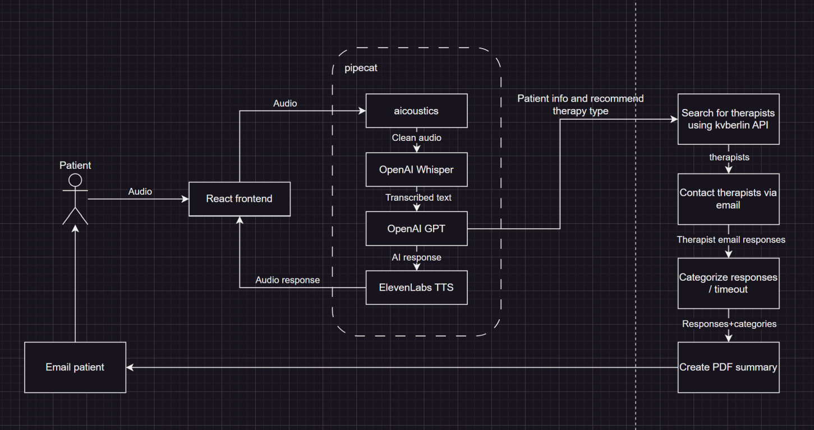

# Therapy Now

https://github.com/Vector-Hector/therapyfinder#



### Onboarding Web UI

We check eligibility of a therapy seeker and onboard them to our service.

The files are in `./apps/demo-frontend`

```sh
pnpm i # installs dependencies

cd apps/demo-frontend
pnpm dev
```

### Onboarding Voice Agent AI

The files are in `./apps/backend`

Description is [here](./apps/backend/README.md).

### Therapy finder

https://github.com/Vector-Hector/therapyfinder